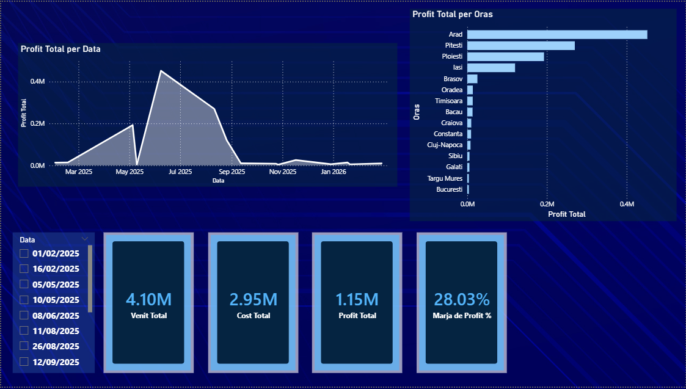
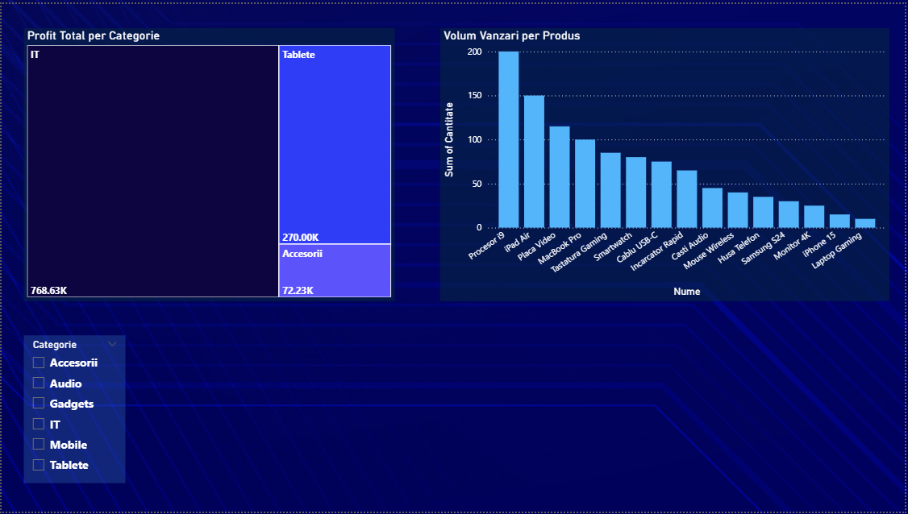
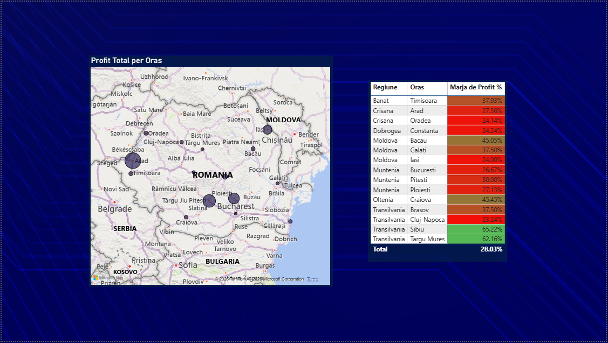

#  Dashboard Analiza Retail PowerBI

## Descriere Proiect
Acest instrument de **Business Intelligence**, realizat în **Power BI**, oferă o analiză detaliată a indicatorilor comerciali pentru o rețea de retail. Proiectul integrează date despre **venituri (4.10M)**, **costuri (2.95M)** și **profitabilitate regională** pentru a sprijini deciziile strategice de business.

---

## Indicatori Cheie (KPIs)
* **Venit Total:** **4.10M**
* **Profit Total:** **1.15M**
* **Marja de Profit:** **28.03%**
* **Eficiență Maximă:** Marjă de peste **60%** identificată în **Sibiu (65.22%)** și **Târgu Mureș (62.16%)**.

---

##  Structură Raport
* **Privire de Ansamblu:** Monitorizarea **volumelor**, a **evoluției profitului** și a indicatorilor principali de performanță.
* **Analiză Produse:** Clasamentul vânzărilor pe unități (Lider: **Procesor i9** cu **200 unități**) și profitul pe categorii (**IT, Tablete, Accesorii**).
* **Performanță Regională:** Distribuția profitului pe **harta României** și analiza marjei pe **15 orașe** folosind **formatare condiționată**.

---

##  Detalii Tehnice
* **Sursă Date:** Date structurate **manual** (**Internal Data Entry**) pentru simularea unui mediu real de retail.
* **Limbaj DAX:** Utilizat pentru calculul precis al măsurilor de **Profit** și **Marjă %**.
* **Design UX/UI:** Interfață de tip **"Dark Mode"** optimizată pentru contrast ridicat și vizibilitate sporită.

---

##  Prezentare Vizuală

